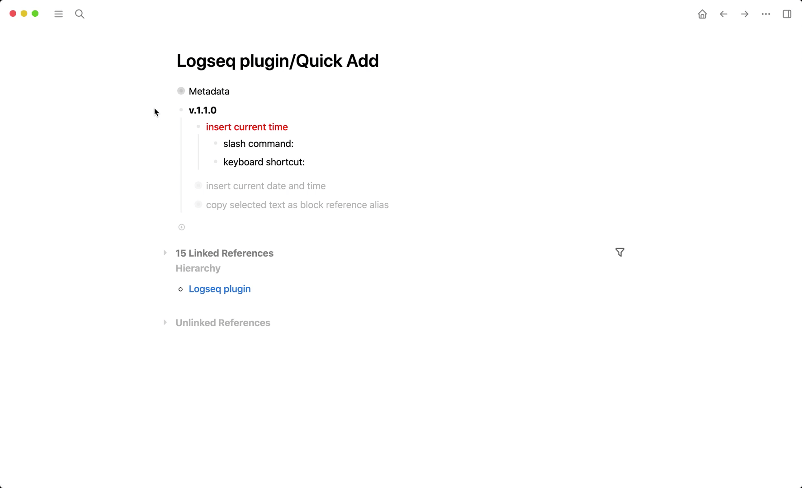
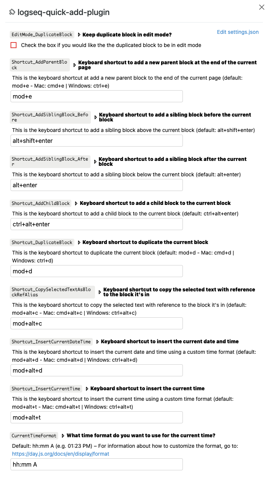

## logseq-quick-add-plugin
> If you find this plugin – or any of my other [Logseq plugins](https://github.com/vyleung?tab=repositories&q=logseq&type=source) – useful and would like to support me, you can [buy me a coffee](https://www.buymeacoffee.com/vyleung) 🙂

## Features
### Use [custom keyboard shortcuts](#settings) to:
#### v.1.1.0+
- Add a parent block to the end of the current page
- Add a sibling block before or after the current block
- Add a child block to the current block
- Duplicate one block or multiple blocks

#### Demo

#### v.1.1.0
- Insert the current time – OR – current date and time 
    - The time format can be configured in the [settings](#settings)
- Copy the selected text as a block reference alias

#### Demo

### Settings
- Each time you make changes to the plugin settings, please refresh Logseq to ensure that all settings are updated  

## Installation
### Preparation
1. Click the 3 dots in the righthand corner → `Settings` → `Advanced` → Enable `Developer mode` and `Plug-in system`
2. Click the 3 dots in the righthand corner → `Plugins` – OR – Use keyboard shortcut `Esc t p`

### Load plugin via the marketplace
1. Click the 3 dots in the righthand corner → `Plugins` – OR – Use keyboard shortcut `Esc t p`
2. Go to the `Marketplace` tab and search for `Quick Add` → Click `Install`

### Load plugin manually
1. Download the [latest release](https://github.com/vyleung/logseq-quick-add-plugin/releases) of the plugin (e.g logseq-quick-add-plugin-v.1.0.0.zip) from Github
2. Unzip the file
3. Navigate to plugins (Click the 3 dots → `Plugins` – OR – Use keyboard shortcut `Esc t p`) → `Load unpacked plugin` → Select the folder of the unzipped file

## License
MIT

## Credits
- Plugin Marketplace Icon: <a href="https://www.flaticon.com/free-icons/writing" title="writing icons">Writing icons created by Smashicons - Flaticon</a>